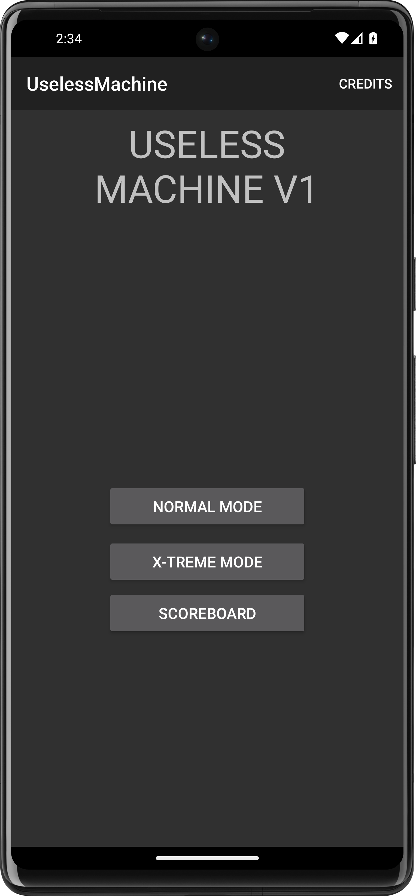

[](https://github.com/MarcelQ5/UselessMachine/actions/workflows/gradle.yml)
[]( https://github.com/MarcelQ5/UselessMachine/releases)


# Useless Machine

<div align="center">
<a href='https://github.com/MarcelQ5/UselessMachine/releases/latest'></a>
</div>

## About The Project

**Useless Machine** is a simple app that simulates a useless machine.

## Screenshots


<div align="center">


</div>
</br>


## Prerequisites

- Android Studio
- Android SDK
- Android N (API 24) or higher

## Installation

Feel free to download the latest release from one of the sources above.  
If you want to build it yourself, follow the steps below.

1. Clone the repo

   ```sh
   git clone https://github.com/MarcelQ5/UselessMachine.git
   ```

2. Open in Android Studio
3. Run on emulator or device

## Contributing

If you want to contribute - open an issue or a pull request.

1. Fork the Project
2. Use understandble commit messages
3. Open a Pull Request

## Contributors

<p align=center>
<a href="https://github.com/MarcelQ5/UselessMachine/graphs/contributors">
  
</a>
</p>
